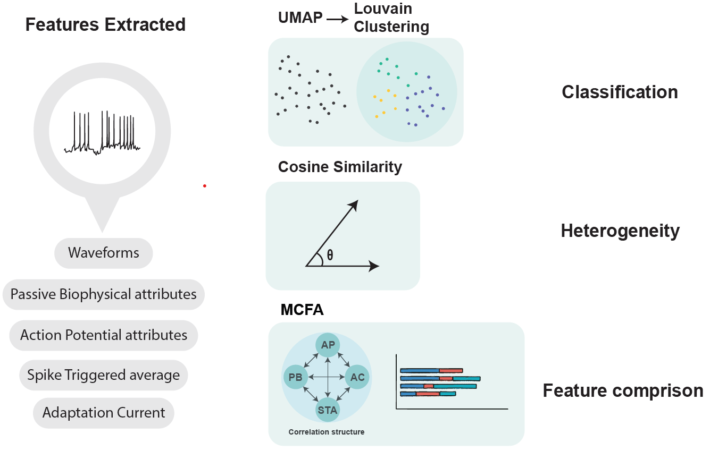
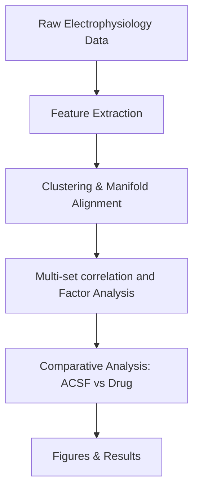

# Swiss-knife for Single-Cell Electrophysiology 


[](https://doi.org/10.1371/journal.pcbi.1013821)
[](LICENSE)

This repository contains the analysis code, Jupyter notebooks, and extracted feature files accompanying the following publications:  

Joshi N, van Der Burg S, Celikel T, Zeldenrust F (2025) Neuronal identity is not static: An input-driven perspective. PLoS Comput Biol 21(12): e1013821. https://doi.org/10.1371/journal.pcbi.1013821 

Neuromodulatory Control of Cortical Function: Cell-Type Specific Regulation of Neuronal Information Transfer
Nishant Joshi, Xuan Yan, Niccolo Calcini, Payam Safavi, Asli Ak, Koen Kole, Sven van der Burg, Tansu Celikel, Fleur Zeldenrust
bioRxiv 2026.03.13.711516; doi: https://doi.org/10.64898/2026.03.13.711516

Extracted Features
Joshi, N., Zeldenrust, F.& Celikel, T. (2025). Data files for: Neuronal Identity is not static: an input driven perspective [Dataset]. Zenodo. https://doi.org/10.5281/zenodo.17625155
---

## Overview
This project provides the computational workflows for analyzing **single-cell electrophysiological recordings** and reproduces the results presented in the associated paper.  

Key methods and analyses:  
- **Feature extraction** from electrophysiological recordings  
- **Model fitting** using GLIF models (see https://github.com/Nishant-codex/GIFFittingToolbox/tree/master)
- **Clustering** of single-cell responses across experimental conditions (ACSF vs. drug)  
- **Dimensionality reduction**: PCA, UMAP, and probabilistic CCA (pCCA)  
- **Manifold alignment** for comparing cell populations
- **MCFA** for comparing extracted features for heterogeneity  
- Exploratory analyses of **cluster stability**, **spike train metrics**, and **impedance profiles**  

---

## Repository Structure
```
notebooks_acsf/        # Analysis under ACSF conditions
notebooks_drug/        # Analysis under drug conditions
residual_code/         # Exploratory / legacy notebooks and scripts
│   └── Infomation_transfer/   # Cluster analysis, PCA, UMAP, stability checks
scripts/         # Containing scripts for visualiztion and cluster stability
src/         # Source code for extracting features and plotting utilities
│   └── single_cell_analysis/   # Cluster analysis, PCA, UMAP, stability checks
	│   └── CC_analysis_utils.py                                                          
			CC_ephys_features.py                                                          
			FN_ephys_features.py                                                          
			neuromod_utils.py                                                             
			plot_utils.py                                                                 
			UMAP_utils.py                                                                 
			utils.py                                                                      
/
LICENSE
README.md              # Project description and usage
```

---

## Installation
Clone the repository and install dependencies:  

```bash
git clone https://github.com/your-username/single_cell_analysis-clustering.git
cd single_cell_analysis-clustering
python -m venv .venv
# activate the environment
python -m pip install --upgrade pip
python -m pip install -r requirements.txt
python -m pip install -e .
```

## Usage
To reproduce the analyses, open the Jupyter notebooks:  

```bash
jupyter notebook notebooks_acsf/Clustering_attribute_sets.ipynb
```

- `notebooks_acsf/` → Main analysis for ACSF  
- `notebooks_drug/` → Drug condition analysis  
- `residual_code/` → Supplemental and exploratory analyses  

Figures and results generated from these notebooks correspond directly to the analyses presented in the paper.  

### Feature extraction examples
You can run the feature extraction scripts directly from the repository root with your own input and output paths.

```bash
python -m src.single_cell_analysis.feature_extraction.Action_potential --input /path/to/data --output /path/to/output
```

```bash
python -m src.single_cell_analysis.feature_extraction.impedance --input /path/to/data --output /path/to/output
```

```bash
python -m src.single_cell_analysis.feature_extraction.STA --input /path/to/data --output /path/to/output
```

```bash
python -m src.single_cell_analysis.feature_extraction.cc_features --input /path/to/data --output /path/to/output --mode both
```

Use `--mode ephys`, `--mode waveform`, or `--mode both` with the CC extractor depending on which feature set you want to produce.

---

## Workflow
Below is a simplified workflow of the analysis pipeline:  



---

## Citation
If you use this code or workflows in your research, please cite:  

```

@article{joshi2025neuronal,
  title={Neuronal identity is not static: An input-driven perspective},
  author={Joshi, Nishant and van Der Burg, Sven and Celikel, Tansu and Zeldenrust, Fleur},
  journal={PLOS Computational Biology},
  volume={21},
  number={12},
  pages={e1013821},
  year={2025},
  publisher={Public Library of Science San Francisco, CA USA}
}
```

---

## License
This project is licensed under the [MIT License](LICENSE).  
